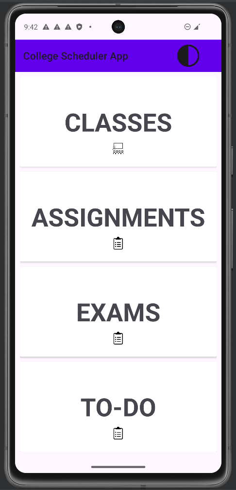
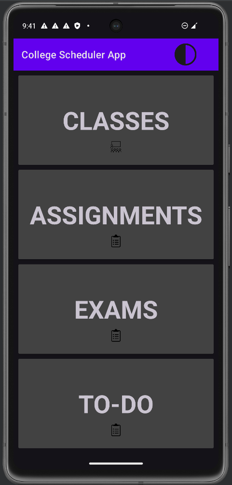

    
    <nav id="navigation">
        <ul>
            <li><a href="/Group-41/">Home</a></li>
            <li><a href="docs/tutorial/1">Part 1</a></li>
            <li><a href="docs/tutorial/2">Part 2</a></li>
            <li><a href="docs/tutorial/3">Part 3</a></li>
            <li><a href="docs/tutorial/4">Part 4:</a></li>
            <li><a href="docs/tutorial/5">Part 5</a></li>
            <li><a href="docs/tutorial/6">Part 6</a></li>
            <li><a href="app">App</a></li>
        </ul>
    </nav>

# [!Demo Video!](hhttps://youtu.be/lJyRYzy4yKE)

# App Description and Guide

Our app is a **college scheduler application** for college students. It features four main functionalities accessible from the main menu upon opening the app. In this guide, I'll detail each of these sections and their utilities.

## Class Manager

The **first option** is a class manager. It's designed for students to keep track of lectures, labs, studios, and other class-related events. Upon accessing the classes section, users are presented with options to add classes and return to the main screen. To add a class:

- Tap on the **Add** button.
- Fill in the fields for the instructor, class name, date, and time. A user-friendly UI assists in selecting the correct date and time.
- **To edit** a course, simply hold down on the desired course. A dialog box will reappear, ready for modifications.

## Assignments Tab

The **second option** is the assignments tab, equipped with features to help track class assignments. Like the class manager:

- Use the **Add** button to input the course name, assignment name, and due date.
- Assignments can be sorted by date or course for easier management.

## Exams Tracker

The **third option** is an exams tracker, mirroring the assignments section's design but focusing on exam details like exam name and the associated course.

## To-Do List

The **fourth option** is a to-do list, allowing students to track general tasks. Adding a task is straightforward:

- Tap on the **Add** button to input a task description and its due date.
- Tasks can be marked as completed or deleted as needed.

This app is particularly beneficial for **Georgia Tech students** who juggle busy schedules with classes, research, internships, interviews, and more.

    -- marko

# Introducing Dark Mode!

